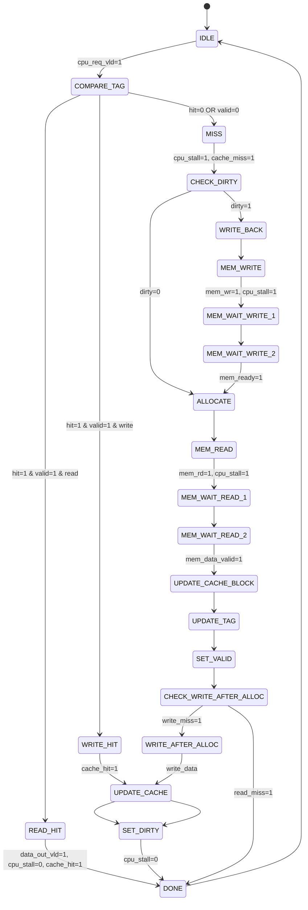

# Simple Cache Controller FSM

```mermaid
stateDiagram-v2
    [*] --> IDLE

    %% =====================
    %% REQUEST START
    %% =====================
    IDLE --> COMPARE_TAG : cpu_req_vld=1

    %% =====================
    %% TAG + VALID CHECK
    %% =====================
    COMPARE_TAG --> READ_HIT : hit=1 & valid=1 & read
    COMPARE_TAG --> WRITE_HIT : hit=1 & valid=1 & write
    COMPARE_TAG --> MISS : hit=0 OR valid=0

    %% =====================
    %% READ HIT
    %% =====================
    READ_HIT --> DONE : data_out_vld=1, cpu_stall=0, cache_hit=1

    %% =====================
    %% WRITE HIT
    %% =====================
    WRITE_HIT --> UPDATE_CACHE : cache_hit=1
    UPDATE_CACHE --> SET_DIRTY
    SET_DIRTY --> DONE : cpu_stall=0

    %% =====================
    %% MISS HANDLING (BLOCKING CACHE)
    %% =====================
    MISS --> CHECK_DIRTY : cpu_stall=1, cache_miss=1

    CHECK_DIRTY --> WRITE_BACK : dirty=1
    CHECK_DIRTY --> ALLOCATE : dirty=0

    %% =====================
    %% WRITE BACK (2-Cycle Memory)
    %% =====================
    WRITE_BACK --> MEM_WRITE
    MEM_WRITE --> MEM_WAIT_WRITE_1 : mem_wr=1, cpu_stall=1
    MEM_WAIT_WRITE_1 --> MEM_WAIT_WRITE_2
    MEM_WAIT_WRITE_2 --> ALLOCATE : mem_ready=1

    %% =====================
    %% ALLOCATE NEW BLOCK (2-Cycle Memory)
    %% =====================
    ALLOCATE --> MEM_READ
    MEM_READ --> MEM_WAIT_READ_1 : mem_rd=1, cpu_stall=1
    MEM_WAIT_READ_1 --> MEM_WAIT_READ_2
    MEM_WAIT_READ_2 --> UPDATE_CACHE_BLOCK : mem_data_valid=1

    %% =====================
    %% UPDATE CACHE
    %% =====================
    UPDATE_CACHE_BLOCK --> UPDATE_TAG
    UPDATE_TAG --> SET_VALID

    SET_VALID --> CHECK_WRITE_AFTER_ALLOC

    %% =====================
    %% WRITE AFTER MISS (WRITE-ALLOCATE)
    %% =====================
    CHECK_WRITE_AFTER_ALLOC --> WRITE_AFTER_ALLOC : write_miss=1
    CHECK_WRITE_AFTER_ALLOC --> DONE : read_miss=1

    WRITE_AFTER_ALLOC --> UPDATE_CACHE : write_data
    UPDATE_CACHE --> SET_DIRTY

    %% =====================
    %% FINISH
    %% =====================
    DONE --> IDLE
```
